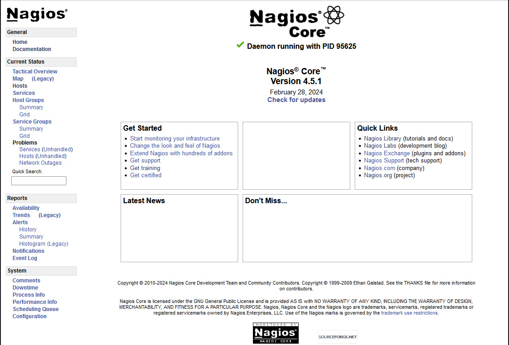

# Installing Apache and Nagios 
This document describes how to install Apache v2.4.52 and Nagios v4.5.1 on AlmaLinux v9.3 running on an x86_64 architecture virtual server. 

Following is a good decription of how to do this: 

https://operavps.com/docs/install-nagios-on-linux/

## Prepare the server 
To prepare for installations of Apache and Nagios, perform the following steps.

- Update the system:
```
yum check-update
yum update
```

## Install Apache
To install Apache and co-requisite packages, perform the following steps:

- Login as root:

```
id
uid=0(root) gid=0(root) groups=0(root) context=unconfined_u:unconfined_r:unconfined_t:s0-s0:c0.c1023
```

- Install Apache and associated packages:

```
yum install gcc glibc glibc-common wget unzip httpd httpd-tools php gd gd-devel openssh-devel perl postfix
```

- Start the ``httpd`` service now and at set it to start at boot time:

```
systemctl start httpd
systemctl enable httpd
```

- Allow ``http`` and ``https`` traffic through the firewall:

```
firewall-cmd --zone=public --add-service=http --permanent
firewall-cmd --zone=public --add-service=https --permanent
```

- Create a sample HTML file.

```
cd /var/www/html
vi index.html
```

- Add the following contents:

```
<html>
<head>
  <title> Nagios server </title>
</head>
<body>
  <p> Nagios will be running here soon!</p>
</body>
</html>
```

- Test your web server by pointing a browser to it.  In this example the URL is ``http://mmac01.example.com/index.html``.

    This shows that Apache is running and serving pages.

## Prepare Nagios
To prepare to install Nagios, perform the following steps.

- Create the user ``nagios`` and set the password:

```
useradd -m -s /bin/bash nagios
passwd nagios
```

- Create new groups and add them to the ``nagios`` user:

```
groupadd nagios 
groupadd nagcmd
usermod -g nagios -G nagios,nagcmd nagios
```

- Add the group ``nagcmd`` to the user ``apache``: 

```
sudo usermod -a -G nagcmd apache 
```

- Show the updated user ids:

```
id nagios
uid=1000(nagios) gid=1000(nagios) groups=1000(nagios),1001(nagcmd)
id apache
uid=48(apache) gid=48(apache) groups=48(apache),1001(nagcmd)
```

## Build Nagios
To build Nagios, perform the following steps.

- Create the directory ``nagios`` in the nagios user's home directory:
```
cd /home/nagios
mkdir nagios
cd nagios/
```

- Download the Nagios core and plugins code:

```
wget https://github.com/NagiosEnterprises/nagioscore/releases/download/nagios-4.5.1/nagios-4.5.1.tar.gz
wget https://github.com/nagios-plugins/nagios-plugins/releases/download/release-2.4.9/nagios-plugins-2.4.9.tar.gz
```

### Build the Nagios core
To build the Nagios core, perform the following steps.

- Untar the code and change to that directory:

```
tar xvf nagios-4.5.1.tar.gz
cd nagios-4.5.1
```

- Create the ``Makefile``. Set the architecture with the ``--build`` option. In this exampe ``x86_64`` is used because this was run on an 64-bit Intel server.

```
./configure --with-command-group=nagcmd --build=x86_64-unknown-linux-gnu 
```

- Build Nagios core with ``make all``:

```
make all
```

## Install Nagios
To install Nagios, perform the following steps.

- Install the code with the following ``make`` commands:

```
sudo make install
```

- Install the systemd ``nagios.service`` file and enable it to start at boot time:

```
make install-daemoninit
systemctl enable nagios
```

- Install Nagios command mode:

```
make install-commandmode
```

- Install sample configuration files:

```
make install-config
```

- Install the web server related code:

```
make install-webconf
```

- Configure the web interface - replace the email address for the Web admin:

```
vi /usr/local/nagios/etc/objects/contacts.cfg
...
define contact {

    contact_name            nagiosadmin             ; Short name of user
    use                     generic-contact         ; Inherit default values from generic-contact template (defined above)
    alias                   Nagios Admin            ; Full name of user
    email                   mmacisaac@example.com
}
...
```

- Create a password file for the user ``nagiosadmin``. These will set the credentials needed to access the site:

```
htpasswd -c /usr/local/nagios/etc/htpasswd.users nagiosadmin
New password:
Re-type new password:
Adding password for user nagiosadmin
```

&nbsp;&nbsp;&nbsp;&nbsp;Remember the credentials!

### Build and install Nagios plugins
To build and install the Nagios plugins, perform the following steps.

- Untar the plugins code:

```
cd ~/nagios
tar xzf nagios-plugins-2.4.9.tar.gz
cd nagios-plugins-2.4.9
```

- Run ``configure`` to create a ``Makefile``: 

```
./configure --with-nagios-user=nagios --with-nagios-group=nagios
```

- Compile and install the plugins using the following ``make`` commands:

```
make
make install
```

The Nagios plugins are now built and installed.

### Update Apache to add Nagios 
Now that Nagios and the plugins are installed, the Apache configuration file can be 
updated to point to the Nagios home page and the ``cgi-bin/`` directory.
which is actually the ``"/usr/local/nagios/sbin"`` directory.

- Edit the Apache configuration file:

```
cd /etc/httpd/conf                
vi httpd.conf
```

- Add the following aliases and directory definitions after the ``DocumentRoot`` line:

```
...
DocumentRoot "/var/www/html"

ScriptAlias /nagios/cgi-bin "/usr/local/nagios/sbin"
<Directory "/usr/local/nagios/sbin">
   Options ExecCGI
   AllowOverride None
   <RequireAll>
     Require all granted
     AuthName "Nagios Access"
     AuthType Basic
     AuthUserFile /usr/local/nagios/etc/htpasswd.users
     Require valid-user
   </RequireAll>
</Directory>

Alias /nagios "/usr/local/nagios/share"
<Directory "/usr/local/nagios/share">
   Options None
   AllowOverride None
   <RequireAll>
     Require all granted
     AuthName "Nagios Access"
     AuthType Basic
     AuthUserFile /usr/local/nagios/etc/htpasswd.users
     Require valid-user
   </RequireAll>
</Directory>
```

- Set the ownership of the password file to ``nagios`` and set the permisison bits accordingly:

```
chown apache.apache /usr/local/nagios/etc/htpasswd.users
chmod 640 /usr/local/nagios/etc/htpasswd.users
```

- Open the firewall to ``http:`` traffic permanently:

```
firewall-cmd --add-port=80/tcp --permanent
firewall-cmd --reload
```

## Test Nagios

- Check the status of Nagios.  It should be running:

```
systemctl status nagios
● nagios.service - Nagios
     Loaded: loaded (/etc/systemd/system/nagios.service; enabled; vendor preset: enabled)
     Active: active (running) since Wed 2024-04-03 09:41:58 EDT; 8s ago
     ...
```

- Point a browser to your new Nagios home page.  In this example, the URL is ``http://model1500/nagios``.

You should be challenged for the credentials in the ``/usr/local/nagios/etc/htpasswd.users`` file created earlier.

The home page should look similar to the following:


Nagios home page

# Configure Nagios 
The Nagios help pages are here: https://assets.nagios.com/downloads/nagioscore/docs/nagioscore/4/en/config.html

TODO: Is NCPA and agent or yet another monitoring tool?

https://www.nagios.org/ncpa/#downloads

## Start monitoring

To start monnitoring some servers, perform the following steps.

- Change to the Nagios ``/etc`` directory and make a copy of the original configuration file:

```
cd /usr/local/nagios/etc
cp nagios.cfg nagios.cfg.orig
```

- Add one line pointing to a new ``hosts.cfg`` file.

```
vi nagios.cfg
...
diff nagios.cfg nagios.cfg.orig
37,39d36
< # Add a config file of hosts to monitor   -MM2
< cfg_file=/usr/local/nagios/etc/objects/hosts.cfg
```

- Change directory to ``objects`` and create the new file named ``hosts.cfg``:

``` 
cd objects
vi hosts.cfg
```

- Add the following content:

```
define host {
  use                   generic-host
  host_name             mmac02.example.com
  alias                 Laptop
  address               192.168.16.39
  max_check_attempts    3
  check_period          24x7
  contact_groups        admins
  check_command         check_tcp!192.168.16.39!22 
 }

define host {
  use                   generic-host
  host_name             cts7xdev.example.com
  alias                 Minimy-server
  address               192.168.16.43
  max_check_attempts    3
  register              1
  contact_groups        admins
  check_command         check_tcp!192.168.16.34!22 
 }

```
*TODO:* VMware Vcenter has a RESTful API to manipulate virtual machines.  For example, the following HTTP POST method will reboot a virtual machine:

``` 
https://{api_host}/api/vcenter/vm/{vm}/guest/power?action=reboot
```

This URL was obtained from here: https://developer.vmware.com/apis/vsphere-automation/latest/vcenter/api/vcenter/vm/vm/guest/poweractionreboot/post/

It would be good to be able to remotely manipulate virtual machines.
